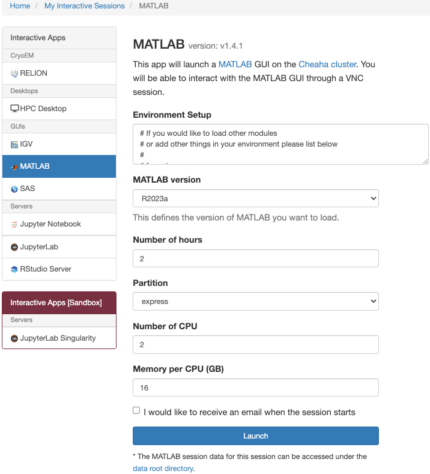

# Matlab

Matlab is available for use graphically in your browser via OOD. As with other standalone programs, you'll need to select the resources required using the job creation form. The form is shown below.



<!-- markdownlint-disable MD046 -->
!!! warning

    Matlab tends to consume substantial memory at startup. You may experience difficulty with job errors below 20 GB of total memory.
<!-- markdownlint-enable MD046 -->

## Using Anaconda Python from within Matlab

Matlab has the ability to interoperate with Python from within Matlab. The official documentation for this featuer may be found at <https://www.mathworks.com/help/matlab/call-python-libraries.html>.

This section is dedicated to using this feature with Anaconda on Cheaha. To use Python contained in an Anaconda Environment within Matlab, please use the following steps.

1. Create an [HPC Interactive Desktop Job](hpc_desktop.md).
1. Open a terminal in that job. The following steps should all be run in this terminal unless otherwise specified.
1. [Load the Anaconda Module](../software/software.md#anaconda-on-cheaha).
1. [Create an Environment](../../workflow_solutions/using_anaconda.md#using-anaconda) in Anaconda with the packages needed.
1. [Activate the Environment](../../workflow_solutions/using_anaconda.md#activate-an-environment),
1. Load the Matlab [Module](../software/modules.md).
1. Start Matlab by entering the command `matlab`.
1. Verify success by entering `pyenv` at the Matlab prompt (not the terminal window). Multiple lines of text will be returned at the prompt. Among them you should see a line like the following, with your environment name in place of `<env_name>`.

    ```text
    Executable: /home/$USER/.conda/envs/<env_name>/bin/python
    ```

You may optionally verify that Python works correctly by entering `py.list(["hello", "world"])`. A python list object should appear in the workspace.

## Using a GPU with MATLAB

Please see the [MATLAB Section on our GPU Page](../slurm/gpu.md#matlab).
