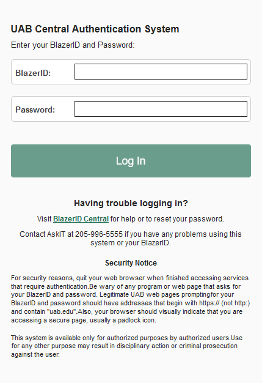
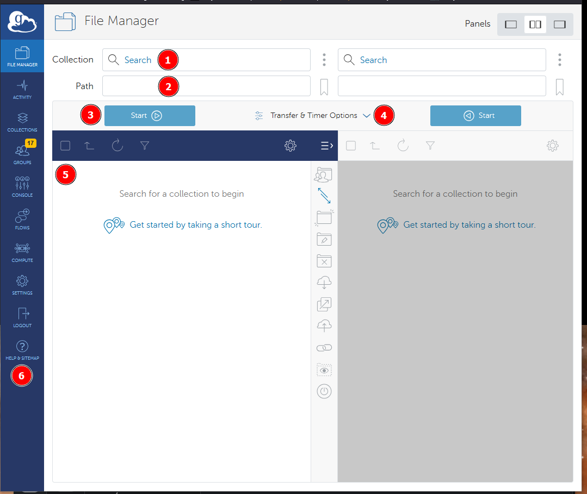

# Globus Tutorials for Individual Researchers

These tutorials are intended for individual researchers who want to use Globus to do the following.

- Transfer research data for their own use or for laboratory use.
- Receive data from other individuals, labs, or Research Cores.

If you need tutorials on using Globus for Research Core data management, please see our [Globus Tutorials for Research Groups](./globus_group_tutorial.md).

The tutorials below will teach you how to effectively use Globus for managing and transferring research data. We will explore what Globus is, why you might use it, and walk you through the essential steps to get started. You will learn how to set up your Globus account, access the Globus application, find collections shared with you, and search for collections by name.

## Prerequisites

For these tutorials, you will need your BlazerID or [XIAS ID](../../account_management/xias/index.md) and password to authenticate using UAB Single Sign-On (SSO).

## What is Globus?

Globus is a data transfer ecosystem that simplifies the process of transferring, sharing, and managing large datasets. It is used by research institutions around the world to move research data between different storage devices, computer systems, and institutions.

## Why use Globus?

Globus has many research data oriented features, making it ideal for many research data transfer scenarios. Below is a list of features.

- Straight-forward, browser-based interface.
- Compatible with [UAB Box](https://www.uab.edu/it/home/tech-solutions/file-storage/box).
- Compatible with [Long-Term Storage](../lts/index.md).
- Can be used with your laptop, desktop, or lab workstation via Globus Connect Personal (GCP).
- Transfers are automatically retried in the event of network or computer system outages.
- Transfers are encrypted end-to-end. Globus never sees your data.
- Suitable for transferring PHI and HIPAA data. Note: a UAB Enterprise IT risk assessment is required.

## How Does Globus Work?

Globus is an ecosystem of software intended to make research data transfer simpler. The Globus web application at <https://app.globus.org> allows you to initiate transfers between any two endpoints you have authorization to access. The Globus Connect Personal (GCP) software lets you turn any computer into a Globus endpoint. At no point do Globus servers touch your research data. Instead, when you initiate a transfer between two endpoints, the Globus application tells the two endpoints that they need to talk to each other and data is sent directly between them. The endpoints update the application with information you may need to know, such as how much data has transferred so far, how fast the transfer is proceeding, and any errors that occur. If the connection between endpoints is interrupted for any reason, the Globus application will attempt to restart the transfer from where it left off.

## How Do I Get Onto the Globus Web App?

1. To get to the Globus web app navigate to <https://app.globus.org>. You should see a page like below.

    

1. Type "UAB" or "University of Alabama at Birmingham" into the search bar to locate UAB in the list. The image below shows the correct choice in a red box.

    

1. Select "University of Alabama at Birmingham" from the drop-down menu and click "Continue" to be taken to the UAB Single Sign-On (SSO) form.

    

1. Enter your BlazerID and password in the SSO form, then click "Log In".

    

1. After logging in, you will be directed to the Globus file manager.

    

1. Enable two-panel view mode by clicking the button located near the top right corner, as shown in the red box below. Of the three available view mode buttons, the two-panel view button is in the center. This is an optional step, but highly recommended. This step will make your life much simpler while using Globus, now and in the future.

    

1. On the file transfer page, you will see two file browser windows: one on the left and one on the right. Each window will have an Endpoint field representing the two systems between which you wish to transfer files. Once set up, you can transfer files in either direction.

    

The file manager will be your most frequently-visited page when using Globus for data transfers. It is central to usage of the Globus web application.Please take some time to familiarize yourself with its look and feel. As you progress in the tutorials, please take time to experiment with transferring data to better understand how the interface works.

## How to Find Collections Shared with You

Globus allows users to share collections with others and also view what is shared with you. To view collections shared with you, please follow these steps:

- Log in to Globus using your credentials.

- From the Globus dashboard, on the left sidebar of the Globus Web App, click on the "Collections" menu.

<!--
 
-->

- Then, click the "Shared with You" button located in the top-right corner. This filter will display all collections that have been shared specifically with your account.

<!--

-->
## How to Search for Collections by Name

To find a specific collection by name, follow these steps:

- Log in to Globus and click on the "File Manager" from the dashboard, as shown below.

<!--
 
-->

- In the File Manager, click the collection search window, as shown below.

<!--
 
-->

- Enter the name (or part of the name) of the collection you are looking for in the search bar.

<!--
 
-->

- Once the search results appear, click on the desired collection to access or transfer files.

<!--
  
-->

## How to transfer data from a shared collection to my project directory on Cheaha?

To transfer data from a shared collection to a project directory on Cheaha, you may follow these steps:

1. Select the Shared Collection:  Click on the Collection tab, then go to the "Shared With You" section and choose the appropriate collection name, for instance, "test collection cheaha". Once selected, you will see the data shared with you.

1. On the other side of the Collection tab, select the UAB Cheaha collection. Authenticate your account if prompted, and navigate to your project directory, e.g., `/data/project/xxx`, where you want to transfer the data.

1. Start the Transfer: Click the "Start" button on the shared collection side. The data, such as the folder `test`, will then be transferred to your specified project directory.

<!--

-->

<!--

-->

## How to transfer data from a shared collection to my group's LTS allocation?

To transfer data from a shared collection to the UAB Long Term Storage (LTS) lab space, start by selecting the LTS lab space collection and authenticating your identity. On the other end of the panel, click the collection and go to "Shared With You" tab and select the shared allocation, such as "test_lts_collection." Set the desired source and destination paths for both collections before proceeding with the transfer.

Once everything is set, click the "Start" button on the shared collection panel to begin the transfer process, which will start automatically. You can monitor the progress by clicking the "refresh list" button on the lab space end to verify that the changes have been made.

<!--

-->

<!--

-->

## How to transfer data between LTS and Cheaha?

You can transfer data between LTS and Cheaha using Globus. To do this, select the LTS collection on one side and the Cheaha collection on the other side in the transfer panel interface, and authenticate the identity.

To transfer data from LTS to Cheaha, make sure the paths are correctly set on both ends by navigating to the appropriate folders. Select the files or folders from the LTS side and click the "Start" button on the left-hand side panel. The data will be transferred and will appear in the right-hand side panel, which corresponds to the Cheaha end.

<!--

-->

Alternatively, to transfer data from Cheaha to LTS, follow the same procedure. Select the files or folders from the Cheaha side and click the "Start" button on the right-hand side panel. The data will then be transferred and will appear in the left-hand side panel, which corresponds to the LTS end.

<!--

-->

## Installing Globus Connect Personal
